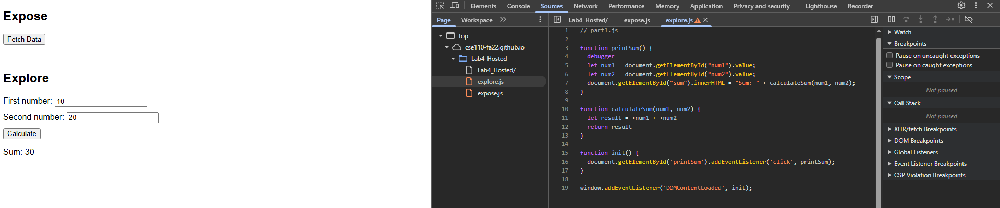

### Question 1

    The bug was that when the num1 and num2 are strings. When they are passed as arguments into the function calculateSum, they are getting passed as strings and num1 + num2 does the string concatenation. That is why when the user input "10" as first, and "20" as second, it returns the result as "1020"

### Question 2

    I added `+` in front of `num1` and `num2` so it converts the string into a number.

